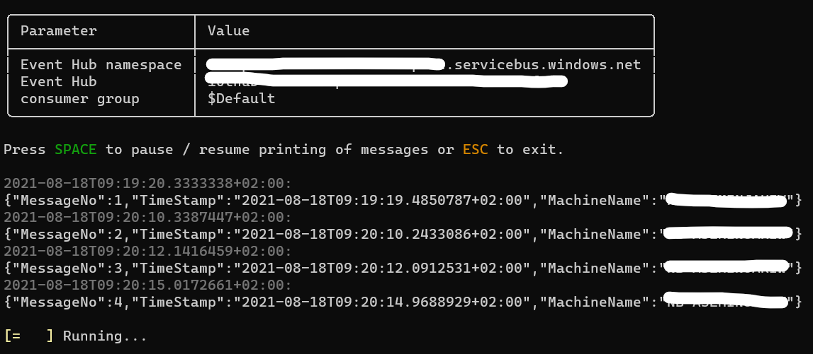

# Event Hub reader
This is a small console program which reads messages from an Azure Event Hub and prints them on the console. There are some options to filter message content or write to file.

## How do I get it?
You can download the tool from the [Releases](https://github.com/aseminjakiw/eventHubReader/releases/latest) or download the source code and run `dotnet build`.

## How do I use it?

1. [Get an connection string from Azure Portal](https://docs.microsoft.com/en-us/azure/event-hubs/event-hubs-get-connection-string#get-connection-string-from-the-portal)

1. Run the `EventHubReader.exe` with the connection string
```powershell
.\EventHubReader.exe "Endpoint=sb://<myendpoint>.servicebus.windows.net/;SharedAccessKeyName=<keyName>;SharedAccessKey=<key>;EntityPath=<eventHubName>"
```

This will print the messages to the console. 



You can press `space` to pause printing to console. Caution: messages will still be consumed in the background but the output to the console holds. If you press space again the next message available will be printed. You can pause the output to examine a message without scrolling back up in the console. 

## How do I configure it?

Use `--help` to see configuration options:
```powershell
> .\EventHubReader.exe --help
USAGE:
    EventHubReader.exe [connectionString] [OPTIONS]

ARGUMENTS:
    [connectionString]    Azure Event Hub connection string as presented in the Azure portal

OPTIONS:
    -h, --help              Prints help information
    -g, --consumer-group    Consumer group of Event Hub to read from. Default value '$Default'
    -c, --contains          Only messages which contain this string will be printed. Can be added multiple times
    -n, --not-contains      Messages containing this string will not be printed. Can be added multiple times
    -f, --file              Writes output to file
```

### Examples

1. Use specific consumer group
```powershell
> .\EventHubReader.exe "some connection string" --consumer-group "my-fancy-consumer-group"
```

2. Print all messages containing `apple` and `house` but not `banana`
```powershell
> .\EventHubReader.exe "some connection string" --contains "apple" --contains "house" --not-contains "banana"
```

3. Write all messages additionally to file `message.txt`
```powershell
> .\EventHubReader.exe "some connection string" --file "message.txt"
```

## Thanks
This repo is heavily inspired by [Peter-B](https://github.com/Peter-B-) and his [IoT hub client](https://github.com/Peter-B-/iot-hub-client). Thank you.
